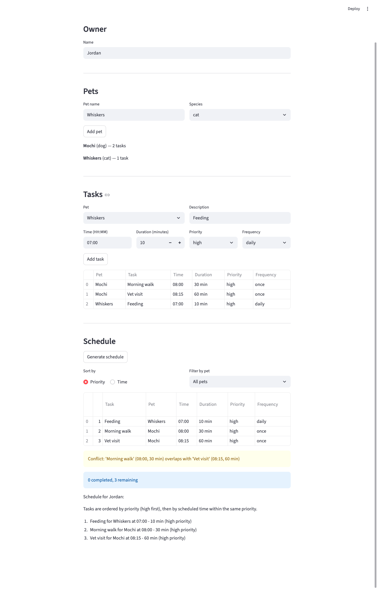

# PawPal+ (Module 2 Project)

You are building **PawPal+**, a Streamlit app that helps a pet owner plan care tasks for their pet.

## Scenario

A busy pet owner needs help staying consistent with pet care. They want an assistant that can:

- Track pet care tasks (walks, feeding, meds, enrichment, grooming, etc.)
- Consider constraints (time available, priority, owner preferences)
- Produce a daily plan and explain why it chose that plan

Your job is to design the system first (UML), then implement the logic in Python, then connect it to the Streamlit UI.

## What you will build

Your final app should:

- Let a user enter basic owner + pet info
- Let a user add/edit tasks (duration + priority at minimum)
- Generate a daily schedule/plan based on constraints and priorities
- Display the plan clearly (and ideally explain the reasoning)
- Include tests for the most important scheduling behaviors

## Getting started

### Setup

```bash
python -m venv .venv
source .venv/bin/activate  # Windows: .venv\Scripts\activate
pip install -r requirements.txt
```

## Demo

<a href="demo_screenshot.png" target="_blank"></a>

## Features

- **Priority-based scheduling** — Tasks are ordered by priority (high > medium > low), then by scheduled time within the same priority level.
- **Chronological sorting** — Toggle to view the full schedule sorted by time instead of priority.
- **Per-pet filtering** — Filter the schedule to show only one pet's tasks at a time.
- **Conflict detection** — Overlapping time windows are flagged with warnings. Adjacent tasks (end time == start time) are correctly recognized as non-conflicting.
- **Recurring tasks** — Tasks can be set to daily, weekly, or one-time frequency. Completing a recurring task generates the next occurrence with an updated due date.
- **Status tracking** — Schedule view shows a summary of completed vs. remaining tasks.
- **Schedule explanation** — The app explains why tasks were ordered the way they were.

## Testing PawPal+

Run the test suite:

```bash
python -m pytest
```

The suite includes 15 tests across five categories:

| Category                 | Tests | What they verify                                                                          |
| ------------------------ | ----- | ----------------------------------------------------------------------------------------- |
| Sorting correctness      | 3     | Chronological ordering, priority-then-time scheduling, stable sort for same-time tasks    |
| Recurrence logic         | 3     | Daily tasks advance by 1 day, weekly by 7 days, one-time tasks produce no next occurrence |
| Conflict detection       | 3     | Overlapping windows flagged, non-overlapping clean, adjacent (end == start) not flagged   |
| Filtering                | 2     | Filter by pet name isolates correctly, filter by status partitions complete vs incomplete  |
| Aggregation / edge cases | 2     | Multi-pet task flattening, empty schedule sentinel                                        |

### Confidence level: 4/5

Core scheduling logic (sorting, recurrence, conflicts) is well covered with both happy paths and boundary conditions. The missing star: we don't yet test the Streamlit UI layer or validate user input edge cases (e.g., malformed time strings).

### Suggested workflow

1. Read the scenario carefully and identify requirements and edge cases.
2. Draft a UML diagram (classes, attributes, methods, relationships).
3. Convert UML into Python class stubs (no logic yet).
4. Implement scheduling logic in small increments.
5. Add tests to verify key behaviors.
6. Connect your logic to the Streamlit UI in `app.py`.
7. Refine UML so it matches what you actually built.
